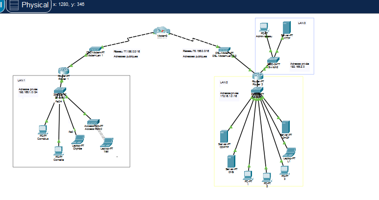

# Simulation Réseau Multi-LAN avec Services (Cisco Packet Tracer)

Projet de simulation réseau réalisé sous Cisco Packet Tracer, mettant en place une interconnexion domicile / établissement scolaire via un lien WAN, avec routage inter-LAN et déploiement de services réseau (DHCP, DNS, FTP, Web).

## Objectif

Concevoir et configurer une infrastructure réseau simulant la connexion d'un réseau domestique à un établissement scolaire réparti sur deux LAN (réseau pédagogique et réseau d'administration), interconnectés via un lien WAN, avec des services réseau fonctionnels et un routage inter-LAN opérationnel.
## Topologie

## Architecture du réseau

Le réseau est composé de 3 LAN reliés entre eux via un WAN (Cluster0 + modems DSL) :

| LAN | Rôle | Plage d'adressage | Équipements |
|---|---|---|---|
| **LAN 1** | Réseau domicile | `192.168.1.0/24` | Router7, Switch0, PC Cornélius, PC Corneille, Laptop Orphée, Access Point, Laptop Méli (Wi-Fi) |
| **LAN 2** | Réseau pédagogique + services (école) | `172.16.1.0/16` | Router8, Switch3, Server DHCP, Server DNS, Server CDI (FTP), postes élèves, Laptop L1 |
| **LAN 3** | Réseau administration (école) | `192.168.2.0/24` | Switch4, PC Admin réseau, Server WEB |

La liaison WAN entre Router7 et Router8 passe par deux modems DSL connectés à un cluster central (`Cluster0`), simulant une interconnexion via adresses publiques (réseaux `77.156.0.0/16` et `78.156.0.0/16`).

## Services configurés

### Serveur DHCP (LAN 2)
- Attribution automatique d'adresses IP aux postes de LAN 2
- Distribution de la passerelle et du serveur DNS

### Serveur DNS (LAN 2)
- Résolution de noms internes (ex. `cdi.ecole.local`, `web.ecole.local`)

### Serveur CDI — FTP (LAN 2)
- Partage de fichiers/documents pédagogiques accessible aux élèves
- Authentification par identifiant/mot de passe

### Serveur WEB (LAN 3)
- Hébergement d'une page web accessible depuis LAN 2 (consultation par les élèves)
- Administré depuis le PC Admin réseau de LAN 3

### Routage inter-LAN
- Routage assuré entre les trois LAN via Router7 et Router8
- Connectivité de bout en bout validée (ping réussi entre tous les LAN)

## Tests réalisés

- [x] Attribution DHCP fonctionnelle sur LAN 2
- [x] Résolution DNS des noms internes
- [x] Connexion FTP au serveur CDI depuis un poste de LAN 2
- [x] Accès HTTP au serveur WEB de LAN 3 depuis LAN 2
- [x] Connectivité complète entre le réseau domicile (LAN 1) et le réseau de l'établissement scolaire (LAN 2, LAN 3) via le WAN (ping)

## Compétences mises en œuvre

- Adressage IP et subnetting
- Configuration de routeurs et switchs Cisco (CLI)
- Déploiement de services réseau : DHCP, DNS, FTP, HTTP
- Routage inter-réseaux
- Diagnostic et résolution d'incidents réseau (APIPA, échec DHCP, absence d'IP serveur)
- Simulation d'architecture réseau avec Cisco Packet Tracer

## Outils

- Cisco Packet Tracer

## Auteur

Cornélius ALLAGNON
